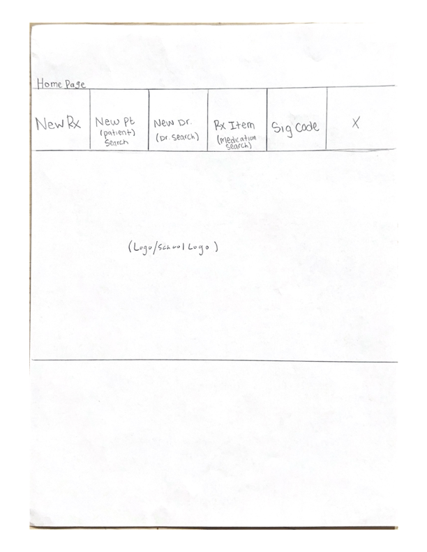
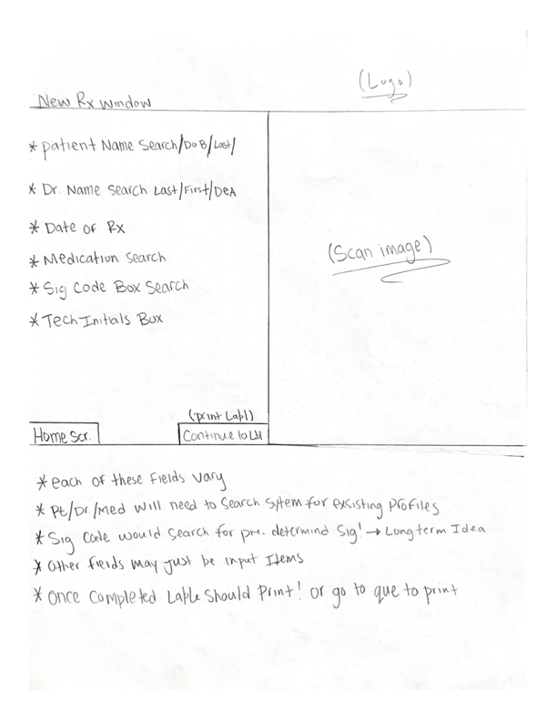
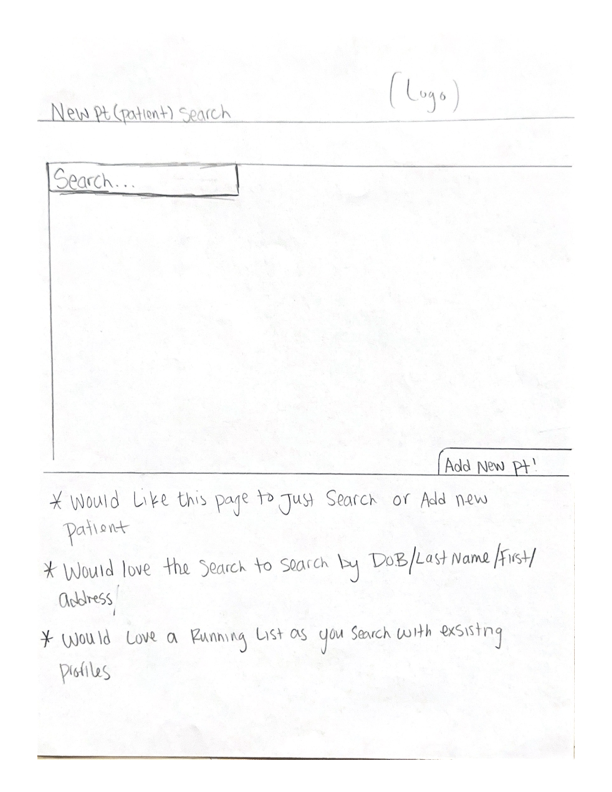
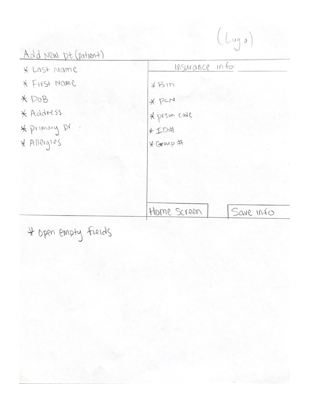
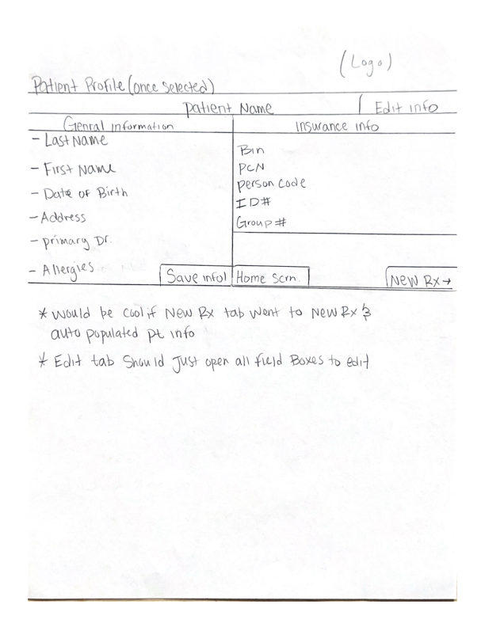
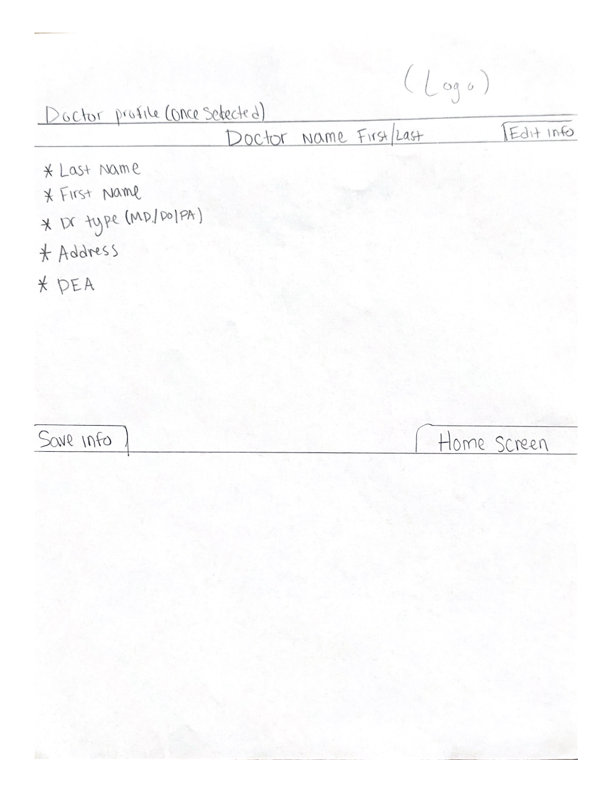
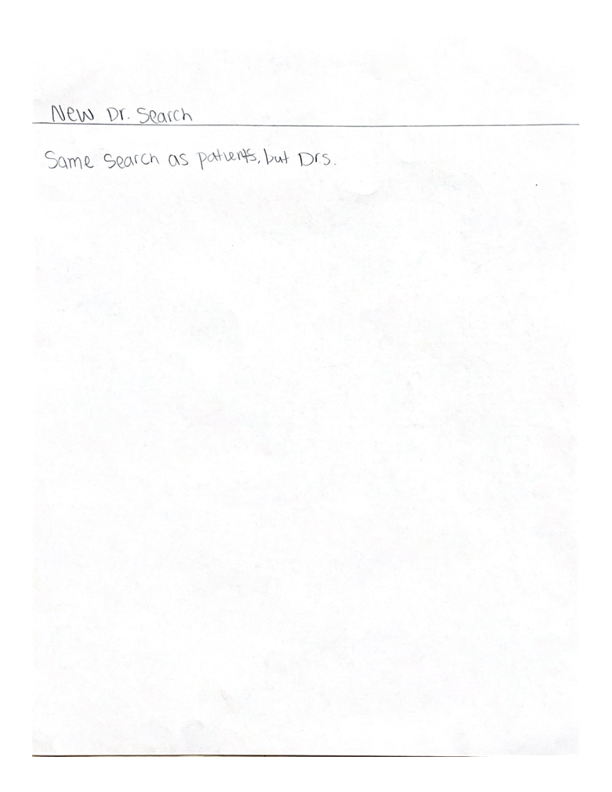

# Design Document for Pharmacy Application

## Overview
This document outlines the design for a Pharmacy Application that allows pharmacy technician students to create and search for patients and doctors, enter prescriptions, and search for medications.

#### Background
Pharmacy Technician students need efficient systems to practice managing patient and doctor information, prescriptions, and medication searches. Existing solutions often lack integration and ease of use.

#### Context
This application aims to streamline the pharmacy workflow by providing a user-friendly interface and robust backend to manage key pharmacy operations.

#### Goals
- Allow creation and search of patient and doctor records.
- Enable entry and search for prescriptions.
- Facilitate medication searches.
- Ability to print prescription labels.

#### Non-Goals
- Inventory management is out of scope for this design.
- Billing and insurance processing are not covered in this document.

## Detailed Design 
### Architecture The application follows a client-server architecture with a React frontend

#### Frontend Components
The following React components will be used to build the frontend example images are supplied by the Pharmacy Technician Instructor Chris Richey at Dixie Technical College:

- **Home**: The landing page of the application.
Provides an overview and navigation to other pages.

- **NewRx**: Page for entering new prescriptions. Contains a form for prescription entry with fields for patient, doctor, medication, dosage, and instructions.

- **Patients**: Page for creating and searching patient records. Includes forms for adding new patients and a search interface for finding existing ones.

- **Doctor**: Page for creating and searching doctor records. Provides forms for adding new doctors and a search interface for finding existing ones.

- **RxSearch**: Page for searching existing prescriptions. Allows users to search for prescriptions by medication or other criteria.
	- Will be similar in design to the previous images listed. Will need to have the ability to search by: brand name, strength (200mg,400mg,…) , NDC (national drug code)

- **SigCode**: Page for searching medication information. Provides a search interface for medication information.

### API 
- Endpoint: GET /Pharmacy/patients
- Endpoint: GET /Pharmacy/doctor
- Endpoint: GET /Pharmacy/rxsearch
- Endpoint: GET /Pharmacy/sigcode

- Endpoint: POST /Pharmacy/patients
- Endpoint: POST /Pharmacy/doctor
- Endpoint: POST /Pharmacy/newrx

### User Interface
- Login screen mockup.

## Implementation Plan
- Phase 1: Set up the project structure and initial frontend components.
- Phase 2: Integrate frontend with backend APIs.
- Phase 3: Implement search functionalities.
- Phase 4: Testing and deployment.

## Testing and Validation
### Testing Strategy
- Unit tests for API endpoints.
- Integration tests for database interactions.
- End-to-end tests for user login flow.
### Dependencies and Requirements
- Dependencies: React, React Router.
- Requirements: Development environment setup, API integration.

## Conclusion and Future Work
### Conclusion
This design provides a comprehensive plan for developing a pharmacy application frontend that is user-friendly and efficient for managing pharmacy operations allowing pharmacy technician students to gain hands-on experience before beginning their career.

### Future Work
- Integration with inventory management systems.
- Addition of billing and insurance processing features.
- Enhanced analytics and reporting capabilities.

## References
All wireframe images were supplied by Chris Richey - Dixie Technical College instructor for Pharmacy Technicians

## Open Questions
Is the X on the homepage a logout???

